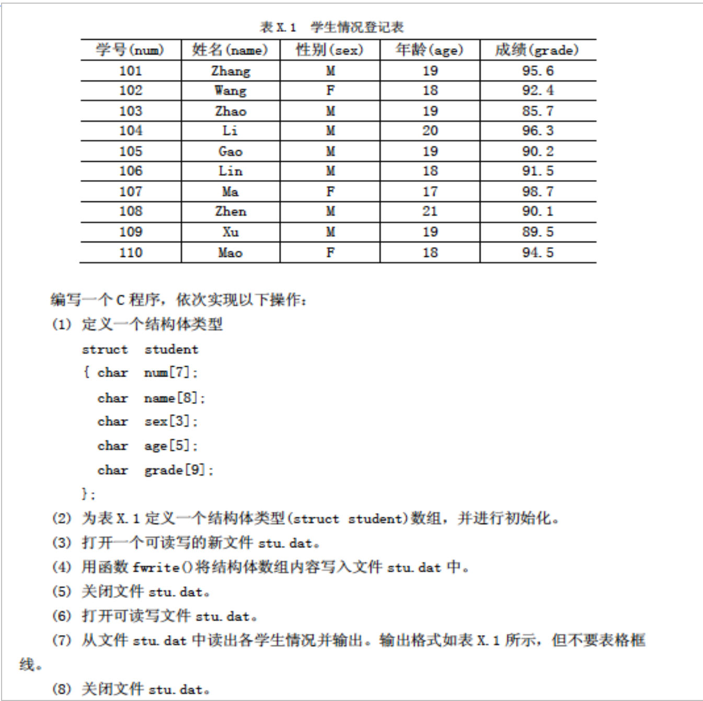

# Experiment14-董皓彧

环境：

```txt
gcc.exe (x86_64-win32-seh-rev1, Built by MinGW-Builds project) 13.2.0
Visual Stdio Code 1.84.2
```

作业仓库地址：
[https://github.com/FHYQ-Dong/Tsinghua-Program-Design-Assignments/tree/main/Experiment14](https://github.com/FHYQ-Dong/Tsinghua-Program-Design-Assignments/tree/main/Experiment14)

## 必做题

### Experiment14-1

**在上次作业中已经完成。**

题目：

```txt
学生信息统计查询（学号、姓名、性别、出生日期、分数）
```

输入格式：

```txt
命令行工具，输入 ./executable.exe --help 查看用法
```

输出格式：

```txt
略
```

代码：

见 [Github Repo](https://github.com/FHYQ-Dong/Tsinghua-Program-Design-Assignments/tree/main/Experiment13/compulsive/Experiment13-1) 或 [Tsinghua Git Repo](https://git.tsinghua.edu.cn/donghy23/Tsinghua-Program-Design-Assignments/-/tree/main/Experiment13/compulsive/Experiment13-1)

可执行文件：

见 [Github Release](https://github.com/FHYQ-Dong/Tsinghua-Program-Design-Assignments/releases/tag/Experiment13-1) 或 [Tsinghua Git Release](https://git.tsinghua.edu.cn/donghy23/Tsinghua-Program-Design-Assignments/-/releases)

### Experiment14-2

题目：

```txt
编写程序，从键盘输入一个字符串（以“#”作为结束），将其中的小写字母全部转换成大写字母，并写入到 upper.txt 文件中。然后再从该文件中的内容读出并显示输出。
```

输入格式：

```txt
一个字符串，以 # 结束
```

输出格式：

```txt
一个字符串，无 #。同时在当前目录下生成 upper.txt 文件
```

代码：

```c
#include <stdio.h>
#include <string.h>
#include <stdlib.h>

int main() {
    char buf, *str;
    int len = 0;
    while ((buf = getchar()) != EOF) {
        if (buf == '#') break;
        str = (char *)realloc(str, (len+1)*sizeof(char));
        str[len++] = buf;
    }
    str = (char *)realloc(str, (len+1)*sizeof(char));
    str[len] = '\0';
    for (int i=0; i<len; ++i) str[i] = str[i] >= 'a' && str[i] <= 'z' ? str[i] - 'a' + 'A' : str[i];
  
    FILE* fin = fopen("upper.txt", "w");
    if (fin == NULL) return 1;
    fprintf(fin, "%s", str);
    fclose(fin);

    FILE* fout = fopen("upper.txt", "r");
    if (fout == NULL) return 1;
    str = fgets(str, len+1, fout);
    printf("%s", str);
    fclose(fout);
    return 0;
}
```

输入1：

```txt
Hello World!#
```

输出1：

```txt
HELLO WORLD!
```

输入2：

```txt
Tsinghua University#
```

输出2：

```txt
TSINGHUA UNIVERSITY
```

输入3：

```txt
Computer Science#
```

输出3：

```txt
COMPUTER SCIENCE
```

输入4：

```txt
Programming Design#
```

输出4：

```txt
PROGRAMMING DESIGN
```

输入5：

```txt
Assignment#
```

输出5：

```txt
ASSIGNMENT
```

### Experiment14-3

题目：

```txt
编写程序，主函数从命令行得到一个文件名，然后调用函数 fgets() 从文件中读入一字符串存放到字符数组 str 中（最多 80 个字符），在主函数中输出字符串与该字符串的长度。
```

输入格式：

```txt
一行，文件名
```

输出格式：

```txt
两行，第一行为字符串，第二行为字符串长度
```

代码：

```c
#include <stdio.h>
#include <string.h>

int main() {
    char filename[100], str[100];
    scanf("%s", filename);
    FILE* fin = fopen(filename, "r");
    if (fin == NULL) {
        perror("Error");
        return 1;
    }
    if (fgets(str, 100, fin) != NULL) printf("%s\n%d", str, strlen(str));
    else perror("Error");
    fclose(fin);
    return 0;
}
```

输入1：

```txt
upper.txt
```

输出1：

```txt
ASSIGNMENT
10
```

## 选做题

### Optional-Experiment14-1

题目：

```txt
编写程序完成以下操作：
```



输入格式：

```txt
如上图
```

输出格式：

```txt
如上图
```

代码：

```c
#include <stdio.h>
#include <stdlib.h>
#include <sys/stat.h>

typedef struct {
    char num[7];
    char name[8];
    char sex[3];
    char age[5];
    char grade[9];
} Student;

FILE* open_file(char* filename, char* mode) {
    FILE* f = fopen(filename, mode);
    if (f == NULL) {
        perror("Error");
        _exit(1);
    }
    return f;
}

int main() {
    Student stu1[10] = {
        "101", "Zhang", "M", "19", "95.6", \
        "102", "Wang", "F", "18", "92.4", \
        "103", "Zhao", "M", "19", "85.7", \
        "104", "Li", "M", "20", "96.3", \
        "105", "Gao", "M", "19", "90.2", \
        "106", "Lin", "M", "18", "91.5", \
        "107", "Ma", "F", "17", "98.7", \
        "108", "Zhen", "M", "21", "90.1", \
        "109", "Xu", "M", "19", "89.5", \
        "110", "Mao", "F", "18", "94.5"
    };

    FILE* fin = open_file("stu.dat", "wb+");
    fwrite(stu1, sizeof(Student), 10, fin);
    fclose(fin);
    fin = open_file("stu.dat", "rb");
    fclose(fin);

    struct stat buf;
    stat("stu.dat", &buf);
    int size = buf.st_size / sizeof(Student);
    Student* stu2 = (Student*)malloc(sizeof(Student) * size);
    FILE* fout = open_file("stu.dat", "rb+");
    fread(stu2, sizeof(Student), size, fout);
    fclose(fout);

    printf("num\tname\tsex\tage\tgrade\n");
    printf("-------------------------------------\n");
    for (int i=0; i<size; ++i) 
        printf("%s\t%s\t%s\t%s\t%s\n", stu2[i].num, stu2[i].name, stu2[i].sex, stu2[i].age, stu2[i].grade);
    return 0;
}
```

输入1：

```txt

```

输出1：

```txt
num	name	sex	age	grade
-------------------------------------
101	Zhang	M	19	95.6
102	Wang	F	18	92.4
103	Zhao	M	19	85.7
104	Li	M	20	96.3
105	Gao	M	19	90.2
106	Lin	M	18	91.5
107	Ma	F	17	98.7
108	Zhen	M	21	90.1
109	Xu	M	19	89.5
110	Mao	F	18	94.5
```
